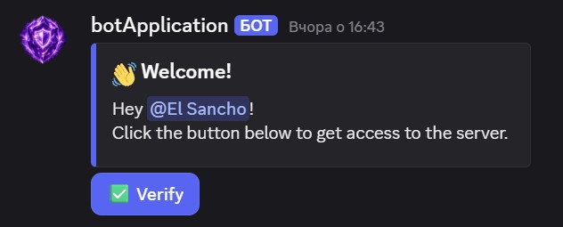
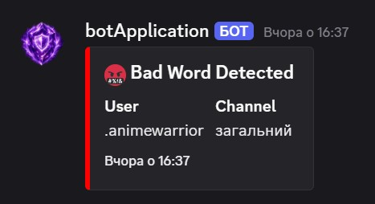
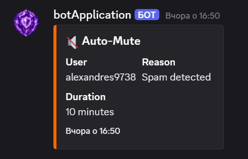
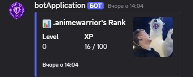
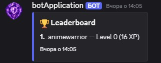
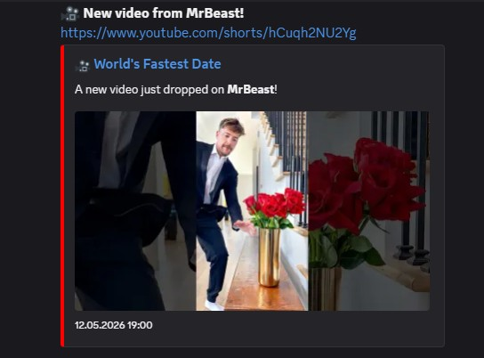

# 🤖 Discord Community Bot

A feature-rich Discord bot built with Discord.js v14, designed for community management, engagement, and automation.

## ✨ Features

### 🔐 Verification & Onboarding
- Button-based verification system for new members
- Automatic welcome message with embed
- Role assignment upon verification
- Gated channels for verified members only

### 🛡️ Moderation
- `/kick` — Kick a member with reason
- `/ban` — Ban a member with reason
- `/warn` — Warn a member with reason
- All actions logged to `#mod-logs` with moderator info and timestamp

### 🤖 Auto-Moderation
- Spam detection — auto-mute after 5 messages in 5 seconds
- Bad word filter — auto-delete and warn
- Link protection — blocks links from new accounts
- Raid protection — enables slowmode when mass joins detected



### ⭐ XP & Leveling System
- XP earned for every message (15–25 XP, 60s cooldown)
- Automatic level-up announcements
- Role rewards at Level 5, 10, and 20
- `/rank` — Check your current XP and level
- `/leaderboard` — Top 10 most active members


### 📺 YouTube Integration
- Automatic announcements when a new video is published
- Rich embed with video thumbnail, title, and link
- Checks for new videos every 5 minutes
- Configurable YouTube channel via environment variables

### 💳 Stripe Subscription Integration
- `/subscribe` — Grant Premium role (triggered by Stripe webhook)
- `/unsubscribe` — Remove Premium role on subscription end
- Webhook server ready for Stripe live integration
- Handles `invoice.payment_succeeded` and `customer.subscription.deleted` events

## 🛠️ Tech Stack

- **Runtime:** Node.js v18+
- **Discord Library:** Discord.js v14
- **Database:** SQLite (better-sqlite3)
- **Payments:** Stripe webhook integration
- **Feed Parsing:** rss-parser
- **Server:** Express.js
- **Config:** dotenv

## 📁 Project Structure
discord-bot/
├── index.js          # Main bot file, commands and event handlers
├── database.js       # SQLite database setup and queries
├── automod.js        # Auto-moderation logic
├── youtube.js        # YouTube RSS feed checker
├── webhook.js        # Stripe webhook server
├── .env.example      # Environment variables template
└── package.json
## ⚙️ Setup

### 1. Clone the repository
```bash
git clone https://github.com/YOUR_USERNAME/discord-bot.git
cd discord-bot
```

### 2. Install dependencies
```bash
npm install
```

### 3. Configure environment variables
```bash
cp .env.example .env
```

Fill in your `.env` file:
```env
TOKEN=your_discord_bot_token
CLIENT_ID=your_discord_application_id
GUILD_ID=your_discord_server_id
YOUTUBE_CHANNEL_ID=youtube_channel_id
PORT=8080
```

### 4. Run the bot
```bash
node index.js
```

## 🔐 Environment Variables

| Variable | Description |
|---|---|
| `TOKEN` | Discord bot token |
| `CLIENT_ID` | Discord application ID |
| `GUILD_ID` | Discord server ID |
| `YOUTUBE_CHANNEL_ID` | YouTube channel ID to monitor |
| `PORT` | Webhook server port |

## 💳 Stripe Webhook Setup

1. Deploy bot to a public server
2. Add webhook endpoint in Stripe Dashboard
3. Subscribe to events:
   - `invoice.payment_succeeded`
   - `customer.subscription.deleted`
4. Add `discord_id` to Stripe customer metadata

## 📊 Commands

| Command | Description | Permission |
|---|---|---|
| `/verify` | Send verification message | Admin |
| `/kick` | Kick a member | Kick Members |
| `/ban` | Ban a member | Ban Members |
| `/warn` | Warn a member | Moderate Members |
| `/rank` | Check your XP and level | Everyone |
| `/leaderboard` | Top 10 active members | Everyone |
| `/subscribe` | Grant Premium role | Admin |
| `/unsubscribe` | Remove Premium role | Admin |

## 📄 License

MIT License — feel free to use this project as a base for your own Discord bot.